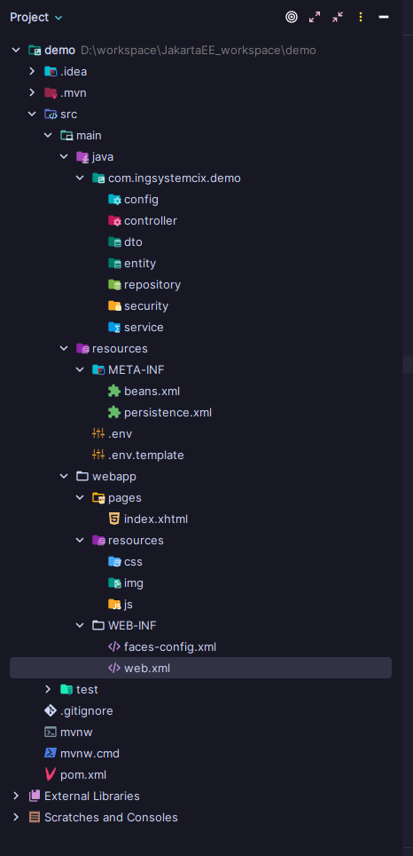

# JSF Guide
To work with JavaServer Faces (JSF) in XHTML files, it is important to know and understand a variety of tags that will allow you to create dynamic and server-linked user interfaces.

# Steps to create a Jakarta EE project

> [!NOTE]
> We need to create a Jakarta EE project with the following specifications.


> [!NOTE]
> We must choose these basic options for an initial project.


## Structure of a base project



## Initial configurations

> [!IMPORTANT]  
> You must modify these parts of the `pom.xml`

```xml
<properties>
    <project.build.sourceEncoding>UTF-8</project.build.sourceEncoding>
    <maven.compiler.target>17</maven.compiler.target>
    <maven.compiler.source>17</maven.compiler.source>
    <junit.version>5.10.0</junit.version>
</properties>
```

```xml
<build>
    <finalName>demo</finalName>
    <plugins>
        <plugin>
            <groupId>org.apache.maven.plugins</groupId>
            <artifactId>maven-war-plugin</artifactId>
            <version>3.4.0</version>
        </plugin>
    </plugins>
</build>
```

> [!IMPORTANT]  
> It is important to add the following dependency for JSF in the `pom.xml`

```xml
<!-- https://mvnrepository.com/artifact/jakarta.faces/jakarta.faces-api -->
<dependency>
  <groupId>jakarta.faces</groupId>
  <artifactId>jakarta.faces-api</artifactId>
  <version>4.1.0</version>
</dependency>
```

> [!IMPORTANT]  
> In the `web.xml` file, we must place the following

```xml
<?xml version="1.0" encoding="UTF-8"?>
<web-app xmlns="https://jakarta.ee/xml/ns/jakartaee"
         xmlns:xsi="http://www.w3.org/2001/XMLSchema-instance"
         xsi:schemaLocation="https://jakarta.ee/xml/ns/jakartaee https://jakarta.ee/xml/ns/jakartaee/web-app_6_0.xsd"
         version="6.0">
    <servlet>
        <servlet-name>Faces Servlet</servlet-name>
        <servlet-class>jakarta.faces.webapp.FacesServlet</servlet-class>
        <load-on-startup>1</load-on-startup>
    </servlet>
    <servlet-mapping>
        <servlet-name>Faces Servlet</servlet-name>
        <url-pattern>*.xhtml</url-pattern>
    </servlet-mapping>

    <welcome-file-list>
        <welcome-file>/pages/**/*.xhtml</welcome-file>
    </welcome-file-list>
</web-app>
```

> [!IMPORTANT]
> The structure of a `*.xhtml` is as follows

```xhtml
<?xml version="1.0" encoding="UTF-8"?>
<!DOCTYPE html>
<html xmlns="http://www.w3.org/1999/xhtml"
      xmlns:h="http://xmlns.jcp.org/jsf/html"
      xmlns:ui="http://xmlns.jcp.org/jsf/facelets"
      xmlns:f="http://xmlns.jcp.org/jsf/core">
<f:view>
    <h:head>
        <meta charset="UTF-8"/>
        <meta name="viewport" content="width=device-width, initial-scale=1.0"/>
        <meta name="author" content="IngSystemCix"/>
        <meta name="description" content="JSF"/>
        <meta name="keywords" content="JSF, JavaServer Faces"/>
        <title>JSF</title>
    </h:head>
    <h:body>
        <header>
            
        </header>
        <main>
            
        </main>
        <footer>
            
        </footer>
    </h:body>
</f:view>
</html>
```