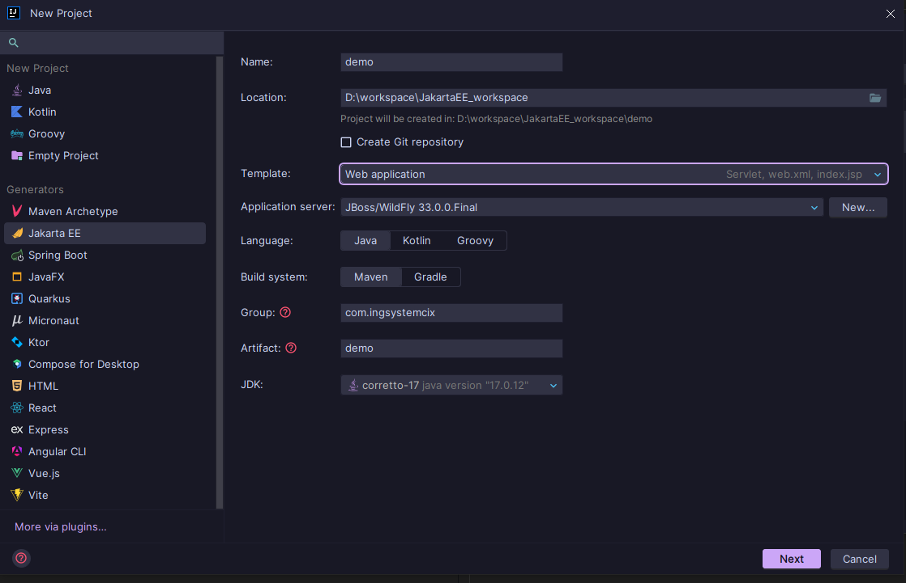
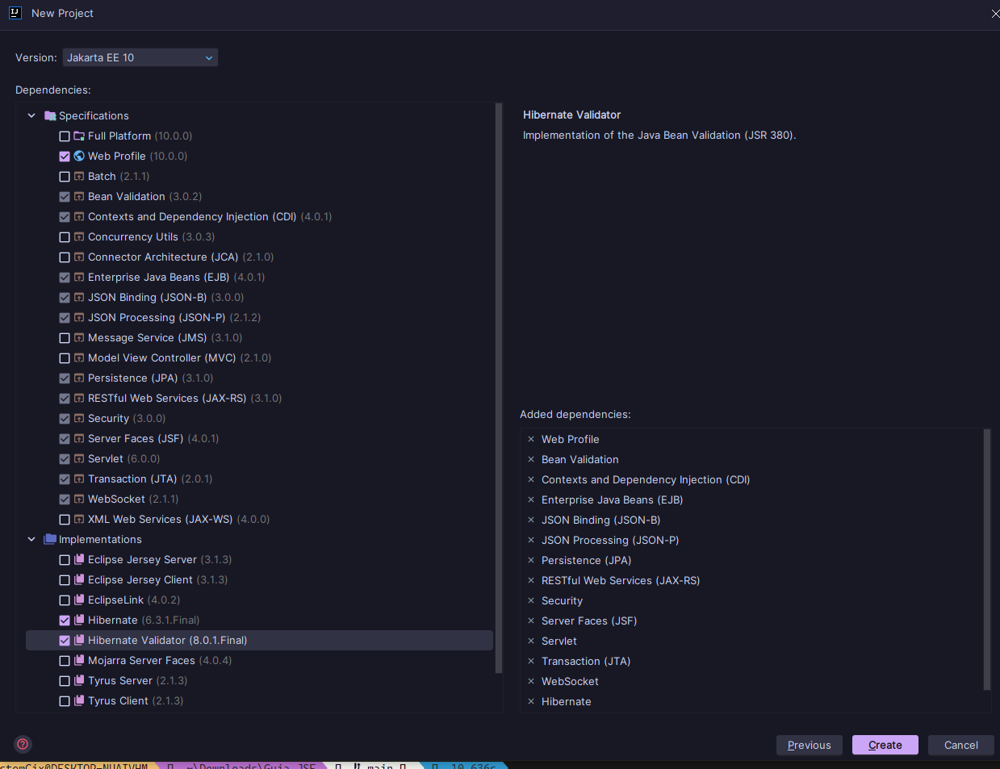

# Guia JSF
To work with JavaServer Faces (JSF) in XHTML files, it is important to know and understand a variety of tags that will allow you to create dynamic and server-linked user interfaces.
# Steps to create a Jakarta EE project

> [!NOTE]
> We need to create a Jakarta EE project with the following specifications.



> [!NOTE]
> We must choose these basic options for an initial project.



## Estructura de un proyecto base

## Initial configurations

> [!IMPORTANT]  
> You must modify these parts of the `pom.xml`

```xml
<properties>
    <project.build.sourceEncoding>UTF-8</project.build.sourceEncoding>
    <maven.compiler.target>17</maven.compiler.target>
    <maven.compiler.source>17</maven.compiler.source>
    <junit.version>5.10.0</junit.version>
</properties>
```

```xml
<build>
    <finalName>demo</finalName>
    <plugins>
        <plugin>
            <groupId>org.apache.maven.plugins</groupId>
            <artifactId>maven-war-plugin</artifactId>
            <version>3.4.0</version>
        </plugin>
    </plugins>
</build>
```

> [!IMPORTANT]  
> It is important to add the following dependency for JSF in the `pom.xml`

```xml
<!-- https://mvnrepository.com/artifact/jakarta.faces/jakarta.faces-api -->
<dependency>
    <groupId>jakarta.faces</groupId>
    <artifactId>jakarta.faces-api</artifactId>
    <version>4.1.0</version>
</dependency>
```